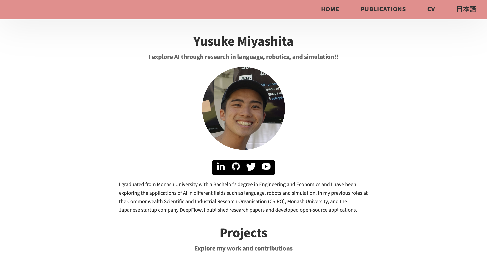

# MinimalFolio: The Simplest Website Template, FREE to Publish on GitHub Pages

Minimal design, easily customizable portfolio via single YAML file for all creators, engineers, and developers.

## [Demo](https://yusuke710.github.io/minimalfolio.github.io/) 🔗
<a href="https://yusuke710.github.io/minimalfolio.github.io/" target="_blank">
  
</a>

## What's in This Repository?
- Customizable Portfolio Template via YAML file, including:
  - About You
  - Project Showcases
  - CV
  - Social Links
- Your Portfolio in Another Language
- Simple Implementation of [Contexto](https://contexto.me/) to engage readers

## How to Setup and Deploy
- Clone this repository by running `git clone https://github.com/Yusuke710/minimalfolio.github.io.git`
- Modify `content.yaml` in any editor of your choice, such as Visual Studio Code
- Publish it on [GitHub Pages](https://docs.github.com/en/pages/getting-started-with-github-pages/creating-a-github-pages-site) for Free!

## Customization 🔧

### Add Information About Yourself
- Go to [content.yaml](content.yaml) and change any sections you like. For example:

```yaml
projects:
  - sectionID: project_1
    sectionClass: project-bg-1
    imgSrc: ./assets/png/economics_video.png
    imgAlt: Software Screenshot
    title: Economics Video with 3B1B Style
    description: >
      This video explains the introductory Consumer Theory in Mathematical Economics, specifically the "Existence of a Utility Function Representing Preference Relation."
    link: 
      text: YouTube Video
      href: https://www.youtube.com/watch?v=tCaYM52Cq2c

```

### Change the Color of the Website
- Follow [Dopefolio](https://github.com/rammcodes/Dopefolio) Github repository to make design changes to `style.css`

### Add Another Language tn Your Portofolio
- Change text `日本語` to any language you like and make sure the translated content is in [content_second_language.yaml](content_second_language.yaml)
```yaml
header:
  logoAlt: Portfolio for Yusuke
  links:
    - text: Home
      href: "./index.html"
    - text: Publications
      href: "./publications.html"
    - text: CV
      href: "https://drive.google.com/file/d/11vvfBDRHPdswER4hXFbxkCMhqUoMKDzq/view?usp=sharing"
    - text: 日本語
      href: "./index.html"
```

### Add a Little Interactive Game, [Contexto](https://contexto.me/)
Run the following code to ensure the game, contexto is working. 
```bash
# Install requests, bs4, openai
$ pip install PyYAML numpy openai

# Export openai key (on Linux)
$ export OPENAI_API_KEY='yourkey'

# Encode words into vector embeddings
$ python word_embedding/text_embed.py
```

Otherwise, remove the section by setting it to `False` like below:

```yaml
quiz:
  mainHeading: Wanna play a game?
  howToPlay: Guess the chosen word within this portofolio to reveal a secret!!
  submit_btn: Submit Guess
  play_contextofolio: False
```

## Credit
[Dopefolio](https://github.com/rammcodes/Dopefolio) <br>

[Contexto](https://contexto.me/) 

## License 📄

This project is licensed under the  **GPL-3.0** License - see the [LICENSE](LICENSE) file for details

